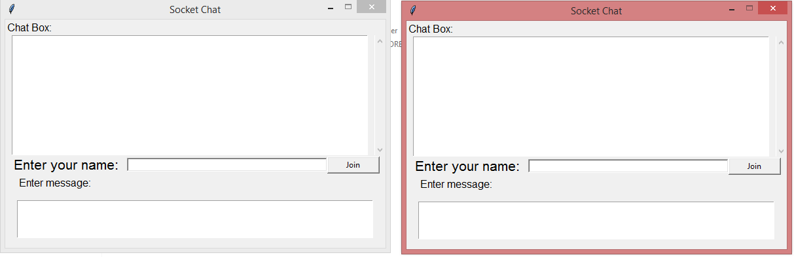
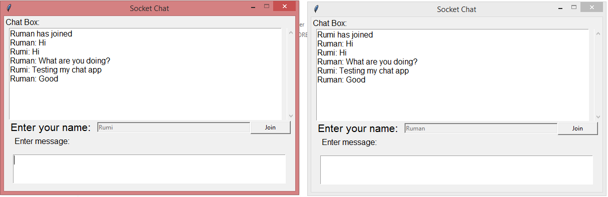

# Socket Chat

Socket Chat is a tool developed on Python3, Tkinter and Socket. You can chat with another user through same network.

## Dependencies

* python3
* tkinter
* socket

## Screenshots

#### Initial State

#### Chat with another user

